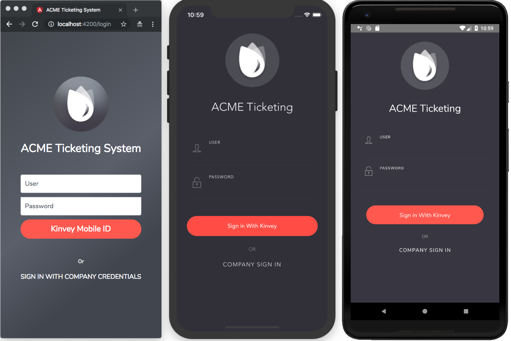

# NativeScript ACME Sample

The following repo is a Kinvey-powered NativeScript app that runs on the web, on iOS, and on Android.



## Prerequisites

See the [NativeScript code-sharing documentation](https://docs.nativescript.org/angular/code-sharing/creating-a-new-project#prerequisites) for details on the requirements you need to run this sample.

## Running your app: web

```
ng serve
```

## Running your app: native

```
tns run ios --bundle
```

or

```
tns run android --bundle
```

## More

You can read more about how to build and extend this app on the [NativeScript code-sharing documentation](https://docs.nativescript.org/angular/code-sharing/intro).